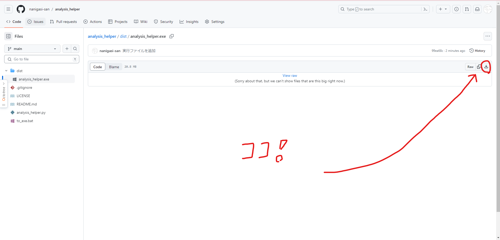
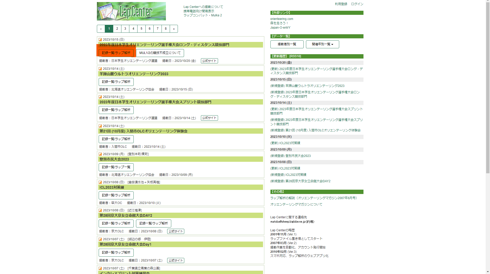
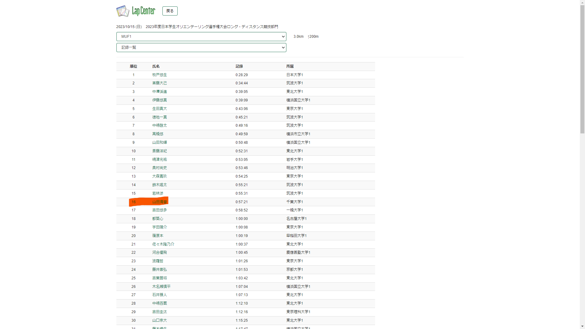
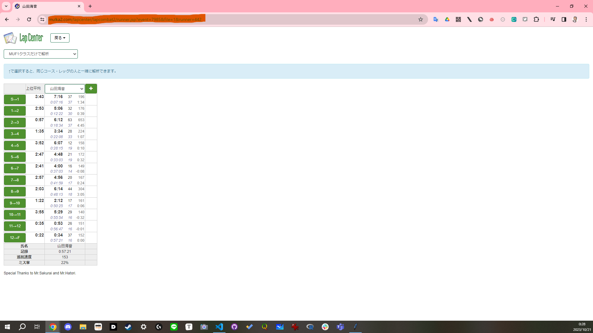
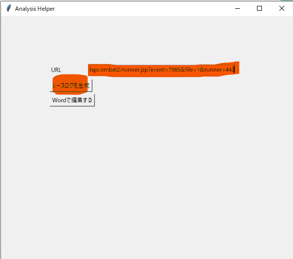
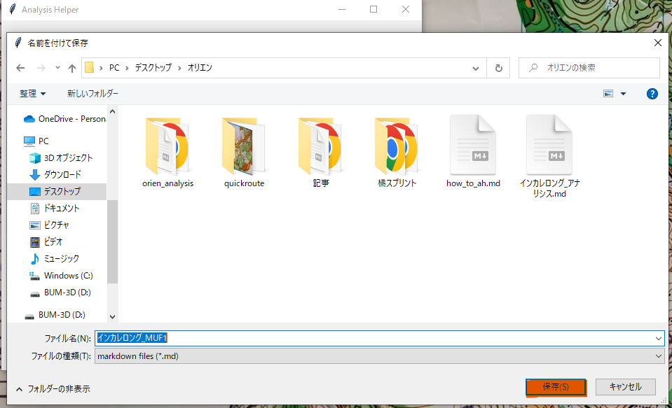
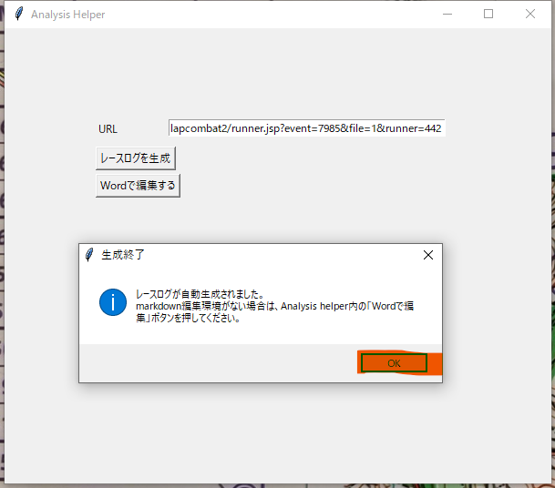
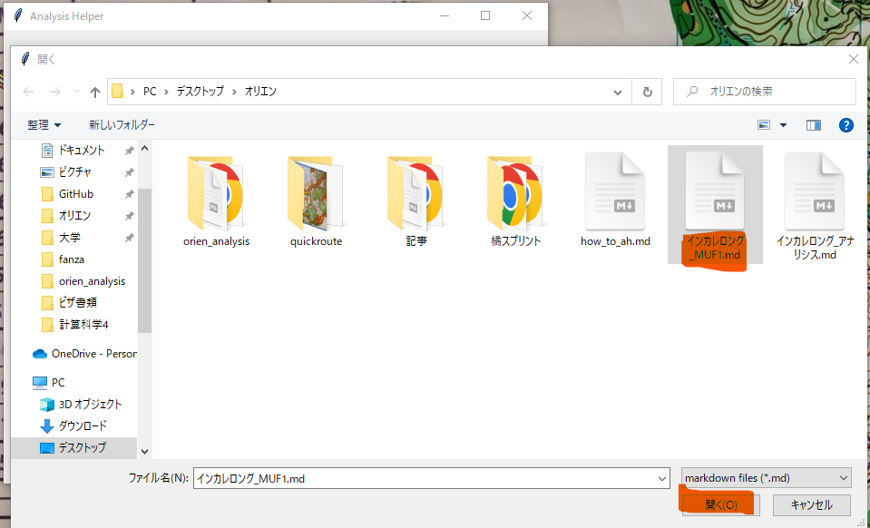
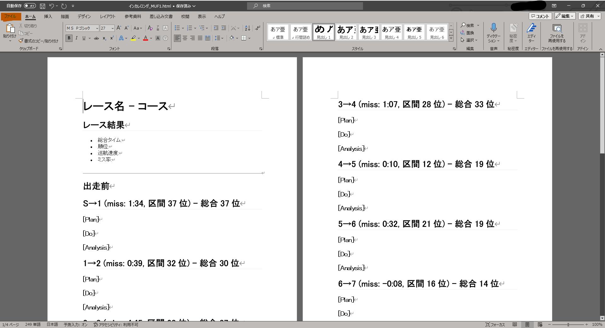
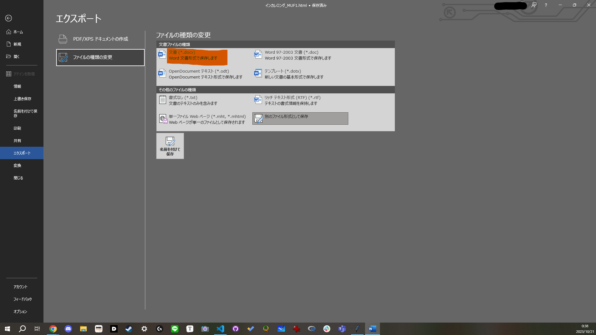

# how to analysis_helper

## analysis_helperとは

オリエンテーリングのアナリシス(レース反省用の自己分析)を書くハードルを下げるために作成されたソフトウェアです。各レッグの

+ Plan
+ Do
+ Analysis

を書くことに集中するために、以下の情報をLapCenterから自動で取得し、アナリシスのテンプレートを生成してくれます。

+ アナリシス全体の流れ
  + レース情報
  + 各レッグ
  + 全体的な課題
  + など
+ 各レッグの情報
  + ミスタイム
  + レッグ順位
  + そのレッグ時点での全体順位

また、アナリシスはmarkdown形式のファイルで生成されますが、編集環境が無い方のために、Wordでの編集機能も提供しています。

(Wordも無い方は、頑張ってmarkdownを編集してください。おすすめはVSCode(無料)かTypora(有料)です)

---

## 使い方

### step0: analysis_helperのダウンロード

以下のリンクからファイルをダウンロードしてください。デスクトップなどに置いておくと使いやすいと思います。(アナリシスを保存する場所は毎回選べるので、このファイル自体はどこに置いても大丈夫です)

https://github.com/nanigasi-san/analysis_helper/blob/main/dist/analysis_helper.exe

### step1: リンクの取得

1. LapCenterを開き、アナリシスを書きたいレースを開く。

2. 自分の出たコースの「記録一覧」を開き、自分の名前をクリックする。

3. このような画面が出てくるので、このページのURLをコピーする。「Ctrl+L」でURLを選択できるので、そこで「Ctrl+C」でコピーできます。このページの場合はhttps://mulka2.com/lapcenter/lapcombat2/runner.jsp?event=7985&file=1&runner=442がURLです。

### step2: アナリシスのひな型を生成する

1. 分かりやすいところ(デスクトップがおすすめです)に保存しておいた`analysis_helper.exe`を実行します。以下のようなウインドウが出てきます。先ほどのURLをボックスに張り付けましょう。「レースログを生成」を押すと作業が始まります。

2. ファイルの保存場所や名前を決めるウインドウが出てくるので、アナリシス置き場を用意しておくとよいです。ファイル名はレース名を入れておくと探しやすいと思います。「保存」を押すと自動で生成が始まります。

3. 生成が終了すると以下のダイアログが表示されます。たいていの人はmarkdownファイルを編集する機会がないと思うので、step3を参考に、Wordで編集をすることをお勧めします。

### step3: Wordで開く
部内の例会記事などで、Wordで編集してPDFに変換することに慣れている方も多いと思います。そのための機能も用意されています。

以下に流れを示します。
1. 「Wordで編集する」を押して、先ほど生成されたファイルを選ぶ。今回は「インカレロング\_MUF1.md」

2. Wordで開かれました。ここでの注意として、ファイルの拡張子は`.docx`ではなく`.html`になっていることに注意してください。(実用上は気にする必要はありませんが、`docx`で探すと見つかりません。)

3. ファイル形式の変換をしたい場合があると思います。Word左上のファイル>エクスポートから、`.pdf(PDF)`や`.docx(Word標準の形式)`に変換することができます。

素敵なオリエンライフを！

作成者：山田海音(千葉大学2021)